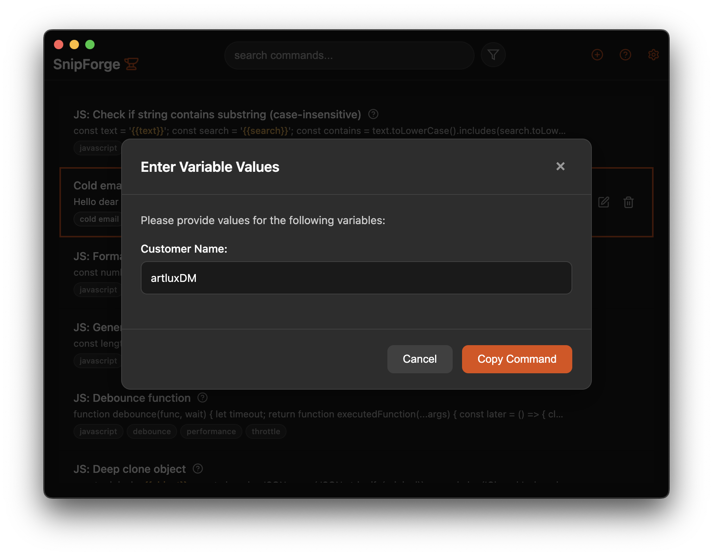

<p align="center">
  
</p>

<h1 align="center">SnipForge</h1>

<p align="center">
  <strong>Your commands, one hotkey away.</strong><br>
  A blazing fast snippet palette that lives on your desktop.<br>
  Save commands, code blocks, prompts, and templates. Search instantly, copy with variables.
</p>

<p align="center">
  <a href="https://snipforge.dev">Website</a> &bull;
  <a href="https://github.com/ArtluxDM/SnipForge/releases/latest">Download</a> &bull;
  <a href="https://github.com/sponsors/ArtluxDM">Sponsor</a>
</p>

<p align="center">
  
</p>

## Why SnipForge

You have hundreds of commands across Docker, Kubernetes, Git, SSH, APIs, and internal tooling. Some live in Notion, some in Slack messages, some you just google every time. SnipForge puts them all in one place — a global hotkey palette that opens from anywhere, searches instantly, and copies to your clipboard with variable substitution.

Teams use it to share command libraries via GitHub repos. New members subscribe to the team library and have every command at their fingertips.

## Features

**Global hotkey** — One shortcut opens SnipForge from any app. Type to search, arrow keys to navigate, Enter to copy. Configurable in settings.

**Variables** — Use `{{variable name}}` templates. When you copy, SnipForge prompts you to fill in each value before it hits your clipboard.

```bash
/add customer {{Customer Name}}
```

<p align="center">
  
</p>

**Multi-format editors** — Plain text, rich text (TipTap), Markdown, and syntax-highlighted code for 15+ languages (JavaScript, Python, Go, Rust, Bash, SQL, YAML, and more).

**Team libraries** — Share command collections through GitHub repos or local folders. Curators publish, members subscribe. Auto-sync keeps everyone current.

**Privacy-first** — Everything stays on your machine. SQLite database, no cloud, no accounts required, no telemetry. GitHub auth is optional and only used for team library sync.

**Keyboard-driven** — Full navigation without a mouse. Customizable shortcuts for every action.

## The Armory

SnipForge ships with **The Armory** — a curated starter library of 477 commands across 39 categories including Git, Docker, Kubernetes, SSH, curl, PostgreSQL, nginx, n8n, and more. Import it from `The Armory/` in this repo, or use it as a reference for building your own libraries.

## Download

Get the latest release from the [Releases page](https://github.com/ArtluxDM/SnipForge/releases/latest):

| Platform | Format |
|----------|--------|
| macOS | `.dmg` |
| Windows | `.exe` |
| Linux | `.AppImage`, `.deb`, `.rpm` |

> **macOS note**: The app isn't code signed yet. Right-click > "Open" > "Open" to bypass Gatekeeper, or run `xattr -cr /Applications/SnipForge.app` in Terminal.

## Quick Start

1. Install and launch SnipForge
2. Press `Cmd+Shift+Space` (or `Ctrl+Shift+Space`) to open the palette
3. Start typing to search — results update in real time
4. Press `Enter` or `C` to copy a command
5. If the command has `{{variables}}`, fill in the values when prompted

### Keyboard Shortcuts

| Key | Action |
|-----|--------|
| `Arrow Keys` | Navigate list |
| `C` / `Enter` | Copy command |
| `Shift+C` | Copy with variables intact |
| `N` | New command |
| `E` | Edit selected |
| `Backspace` | Delete selected |
| `Escape` | Clear search / close |
| `S` | Settings |

All shortcuts are customizable in Settings > General.

### Team Libraries

1. Open Settings > **Libraries**
2. Sign in with GitHub (Settings > Connectors)
3. Enter a repo URL (e.g., `org/team-commands`)
4. Click **Subscribe** — commands sync to your palette

Libraries support auto-sync, local folders, and role-based permissions (owner/curator/consumer). See [docs/remote-libraries.md](docs/remote-libraries.md) for details.

## Build from Source

```bash
git clone https://github.com/ArtluxDM/SnipForge.git
cd SnipForge
pnpm install
pnpm dev       # development
pnpm build     # production build
```

## Tech Stack

| Layer | Technology |
|-------|-----------|
| Desktop | Electron + Vue 3 + Vite + TypeScript |
| Database | SQLite via better-sqlite3 |
| Editors | CodeMirror 6 (code/markdown), TipTap (rich text) |
| Search | Fuse.js (weighted fuzzy search) |
| UI | Lucide icons, Virtua (virtual scrolling), highlight.js |

## Documentation

- [Remote Libraries](docs/remote-libraries.md) — GitHub/local library setup, sync algorithm, publishing
- [DB Health](docs/db-health.md) — SQLite maintenance checks and DB test recovery
- [Codebase Map](docs/codebase-map.md) — File reference, architecture, IPC channels
- [Settings](docs/settings.md) — Configuration, hotkey remapping, auto-sync
- [Variable Substitution](docs/variable-substitution.md) — Template syntax and copy flow

## Support

SnipForge is built and maintained independently. If you or your team uses it, consider [sponsoring the project](https://github.com/sponsors/ArtluxDM) to keep development active.

## License

[GNU Affero General Public License v3.0](LICENSE) (AGPL-3.0). Free to use, modify, and distribute. Modifications must be released under AGPL with full source code.

For commercial licensing inquiries, reach out at [contact@snipforge.dev](mailto:contact@snipforge.dev).
