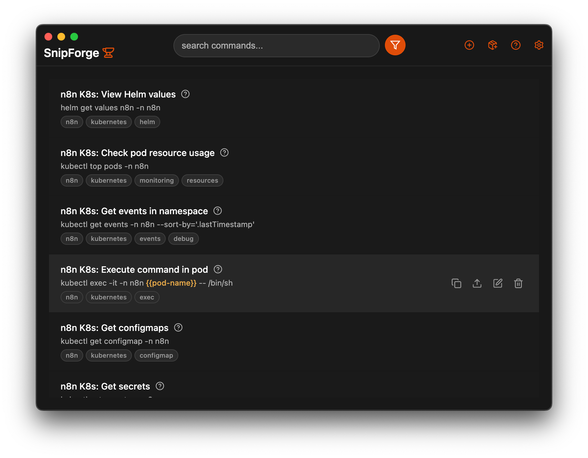

<p align="center">
  
</p>

<h1 align="center">MemoShelf</h1>

<p align="center">
  <strong>A lightweight memory shelf for things you may need again.</strong><br>
  Now store it. Later find it.
</p>

<p align="center">
  <a href="https://github.com/qiyadeng/MemoShelf/releases/latest">Download</a> &bull;
  <a href="docs/codebase-map.md">Documentation</a>
</p>

<p align="center">
  
</p>

## Why MemoShelf

MemoShelf is a desktop app for saving searchable bits of text, snippets, commands, paths, prompts, notes, and other small pieces of information that are too useful to lose but too lightweight for a full notebook.

It is meant for the in-between things: text you copy often, a path you do not want to rediscover, a setup command you only need once a month, a temporary note that might become useful later, or a small reference you want to keep close.

## Features

**Body-first capture** - Paste or write the thing you want to remember first. MemoShelf can fill the title and tags from the content, and you can still edit them by hand.

**Fast fuzzy search** - Search across titles, tags, descriptions, and bodies with a keyboard-friendly palette.

**Multiple text formats** - Store plain text, Markdown, rich text, and syntax-highlighted code snippets.

**Template variables** - Use `{{variable name}}` placeholders and fill them in when copying.

**Local-first storage** - Data stays on your machine with SQLite and file-backed libraries. GitHub-backed libraries are optional for sharing or syncing.

**Lightweight by design** - MemoShelf sits between a notebook and a command launcher: less ceremony than notes, more durable than clipboard history.

## Download

Get the latest build from the [Releases page](https://github.com/qiyadeng/MemoShelf/releases/latest).

The first public Windows build is packaged as an `.exe` installer.

## Quick Start

1. Install and launch MemoShelf.
2. Choose a default writable library folder on first run.
3. Press `Cmd+Shift+Space` or `Ctrl+Shift+Space` to show the shelf.
4. Press `N` to add a new memory.
5. Paste the body first; title and tags are generated automatically.
6. Search later and press `Enter` or `C` to copy.

## Keyboard Shortcuts

| Key | Action |
|-----|--------|
| `Arrow Keys` | Navigate list |
| `C` / `Enter` | Copy selected memory |
| `Shift+C` | Copy template with variables intact |
| `N` | New memory |
| `E` | Edit selected memory |
| `Backspace` | Delete selected memory |
| `Escape` | Clear search or close |
| `S` | Settings |

All shortcuts are customizable in Settings > General.

## Libraries

MemoShelf supports local folders and GitHub-backed libraries. A library is a folder of JSON files that can be searched, copied, imported, exported, and optionally synced.

Compatibility note: this version keeps SnipForge-compatible library files such as `.snipforge.json` so existing libraries continue to work while the product moves to the MemoShelf name.

## Build from Source

```bash
git clone https://github.com/qiyadeng/MemoShelf.git
cd MemoShelf
pnpm install
pnpm dev
pnpm build:fast
pnpm build:app
```

`pnpm build:fast` rebuilds native Electron dependencies only when needed, then runs the Vite build. `pnpm build:app` does the same and packages the desktop app with electron-builder.

## Tech Stack

| Layer | Technology |
|-------|------------|
| Desktop | Electron + Vue 3 + Vite + TypeScript |
| Database | SQLite via better-sqlite3 |
| Editors | CodeMirror 6, TipTap |
| Search | Fuse.js |
| UI | Lucide icons, Virtua, highlight.js |

## Documentation

- [Remote Libraries](docs/remote-libraries.md)
- [DB Health](docs/db-health.md)
- [Codebase Map](docs/codebase-map.md)
- [Settings](docs/settings.md)
- [Variable Substitution](docs/variable-substitution.md)

## License

[GNU Affero General Public License v3.0](LICENSE) (AGPL-3.0).
